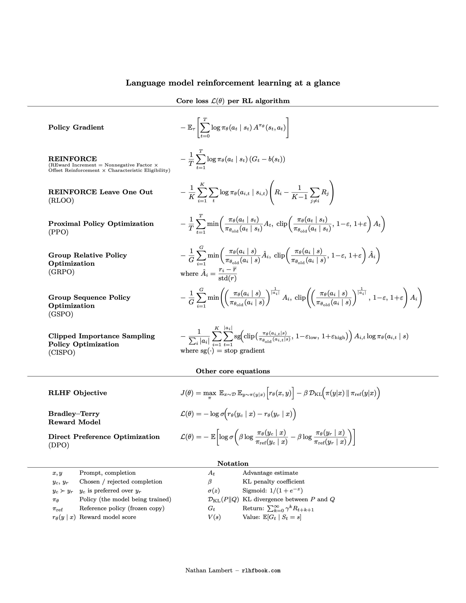

# Notes

## Context: RL for LLMs

- Pipeline: pre-training → supervised fine-tuning → preference/reasoning fine-tuning.
- Goal: improve using human preferences or verifiable rewards when web-scale data is saturated.
- Challenge: propagate a sparse final reward through long token trajectories; variance is high.

## PPO (actor–critic with clipping)
- Advantage: $A_t = Q(s_t, a_t) - V(s_t)$.
- Ratio: $r_t(\theta) = \dfrac{\pi_{\text{new}}(a_t \mid s_t)}{\pi_{\text{old}}(a_t \mid s_t)}$.
- Clipped objective: $L_{\text{CLIP}} = \mathbb{E}\big[\min(r_t A_t,\ \text{clip}(r_t, 1-\epsilon, 1+\epsilon)\, A_t)\big]$.
- Pros: stable; mitigates collapse. Cons: heavier compute/memory (policy + ref + reward + critic).

## DPO (direct preference optimization)
- Bradley–Terry preference: $P(y_w > y_l) = \sigma\big(r(x, y_w) - r(x, y_l)\big)$.
- Loss using log-prob ratios to a frozen reference: $L_{\text{DPO}} = -\mathbb{E}\big[\log \sigma(\beta \log \tfrac{\pi_\theta(y_w\mid x)}{\pi_{\text{ref}}(y_w\mid x)} - \beta \log \tfrac{\pi_\theta(y_l\mid x)}{\pi_{\text{ref}}(y_l\mid x)})\big]$.
- Pros: simple (policy + reference only). Cons: best aligned to pairwise preference data.

## GRPO (group-relative policy optimization)
- Group sampling: draw $G$ outputs per prompt; compute group mean/std of rewards.
- Normalized advantage: $A_i = \dfrac{r_i - \text{mean}(\text{Rewards}_{\text{group}})}{\text{std}(\text{Rewards}_{\text{group}})}$.
- Loss: $L_{\text{GRPO}} = L_{\text{PPO\_CLIP}} + \beta\, D_{\text{KL}}(\pi_\theta \,\|\, \pi_{\text{ref}})$.
- Pros: removes critic → memory/compute savings; good for verifiable rewards. Cons: needs multiple samples per prompt; sensitive to group size.

## Policy gradient & REINFORCE
- Return: $G_t = r_t + \gamma r_{t+1} + \gamma^2 r_{t+2} + \dots$
- Update: $\theta_{t+1} = \theta_t + \alpha \,\nabla \log \pi_\theta(a_t \mid s_t)\, G_t$
- Loss form: $L_{\text{REINFORCE}} = -\sum_t G_t \log \pi_\theta(a_t \mid s_t)$
- With baseline $b$: use $G_t - b$ to reduce variance (critic in PPO; group stats in GRPO).
- Pros: simple, unbiased; supports stochastic policies. Cons: high variance; Monte Carlo delay.

## Summary table (from PDF)
| Feature | PPO | DPO | GRPO |
| --- | --- | --- | --- |
| Type | RL (actor–critic) | Direct preference optimization | RL (policy gradient) |
| Models | Policy, reference, reward, value (critic) | Policy, reference | Policy, reference (no critic) |
| Baseline | Learned value | N/A | Group mean/std |
| Mechanism | Clipping | Log-sigmoid margin loss | Group-normalized advantage + clip + KL |
| Complexity | High | Low | Medium |
| Use case | General RLHF | Preference fine-tuning | Reasoning (math/code/logic) |

## Symbol reference (LLM context)
| Symbol | Meaning |
| --- | --- |
| $x$ | Input prompt |
| $y_w, y_l$ | Preferred and rejected responses |
| $\pi_\theta$ | Current policy (LLM) |
| $\pi_{\text{old}}$ | Policy at data collection |
| $\pi_{\text{ref}}$ | Frozen reference policy |
| $r_t$ | Reward at step $t$ (often terminal) |
| $G_t$ | Discounted return |
| $A_t$ | Advantage (with critic or group baseline) |
| $r_t(\theta)$ | Ratio $\pi_\theta / \pi_{\text{old}}$ |
| $\epsilon$ | Clip range |
| $\beta$ | KL or preference strength |
| $\gamma$ | Discount factor |
| $\alpha$ | Learning-rate or entropy coefficient (contextual) |

## References
- **RL for LLMs / RLHF**
  - Christiano et al., *Deep Reinforcement Learning from Human Preferences* ([arXiv:1706.03741](https://arxiv.org/abs/1706.03741))
  - Ouyang et al., *Training language models to follow instructions with human feedback* ([arXiv:2203.02155](https://arxiv.org/abs/2203.02155))
- **PPO (Proximal Policy Optimization)**
  - Schulman et al., *Proximal Policy Optimization Algorithms* ([arXiv:1707.06347](https://arxiv.org/abs/1707.06347))
- **DPO (Direct Preference Optimization)**
  - Rafailov et al., *Direct Preference Optimization: Your Language Model is Secretly a Reward Model* ([arXiv:2305.18290](https://arxiv.org/abs/2305.18290))
- **GRPO (Group-Relative Policy Optimization)**
  - DeepSeek AI, *DeepSeekMath: Pushing the Limits of Mathematical Reasoning in Open Language Models* ([OpenReview](https://arxiv.org/abs/2402.03300))
- **Policy gradient / REINFORCE**
  - Williams, *Simple statistical gradient-following algorithms for connectionist reinforcement learning* ([DOI:10.1007/BF00992696](https://doi.org/10.1007/BF00992696))
- **Reference sheet source**
  - Lambert, *Reinforcement Learning from Human Feedback* ([rlhfbook.com](https://rlhfbook.com))

